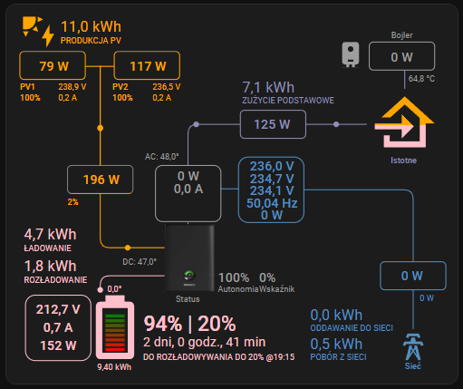
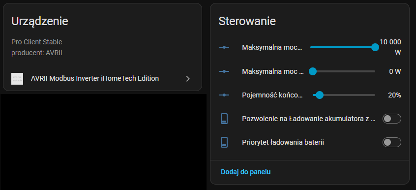
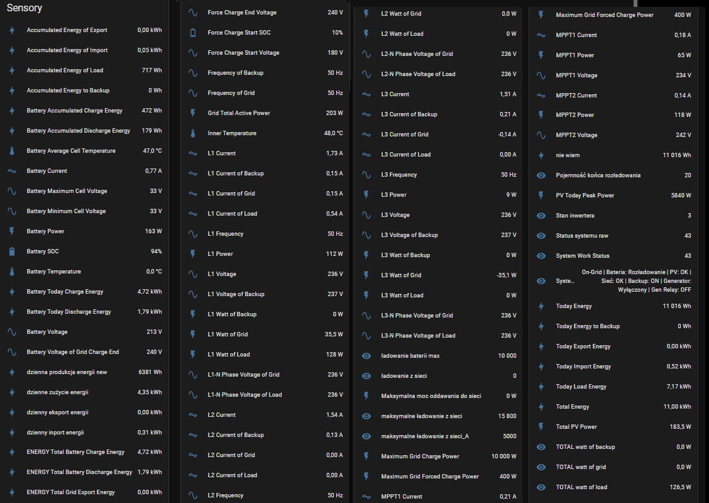

## Dashboard

# AVRII Modbus Inverter iHomeTech Edition

Integracja falowników AVRII z Home Assistant przez Modbus TCP.

## Funkcje

- odczyt parametrów falownika
- moc PV
- napięcia
- prądy
- produkcja energii
- stan baterii
- komunikacja Modbus TCP
- konfiguracja przez UI Home Assistant

## Instalacja przez HACS

1. Otwórz HACS
2. Przejdź do Integrations
3. Wyszukaj AVRII
4. Zainstaluj integrację
5. Uruchom ponownie Home Assistant
6. Dodaj integrację AVRII

## Konfiguracja

Integracja jest konfigurowana z poziomu Home Assistant.

## Licencja

Apache License 2.0
